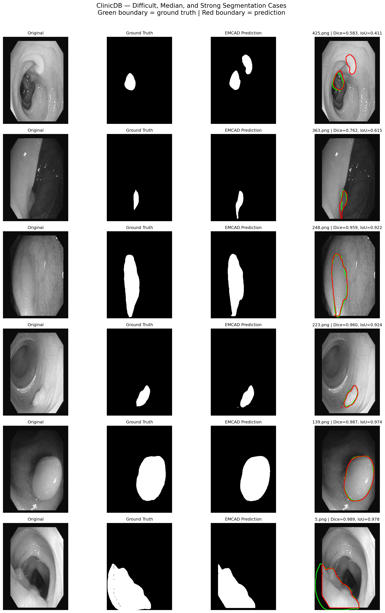
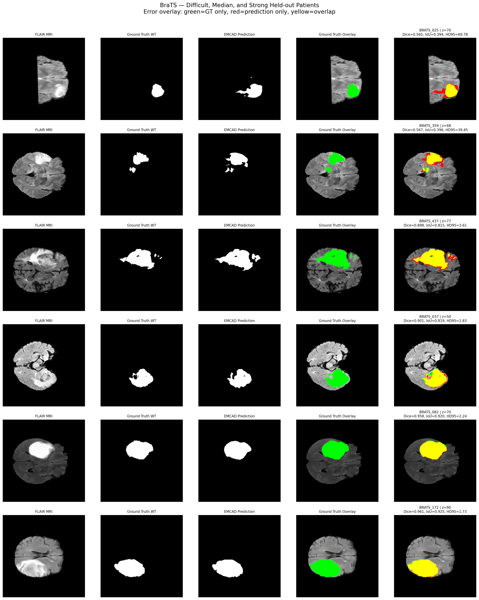

# EMCAD Reproduction and Cross-Domain Adaptation

Reproducibility study and new-domain adaptation of **EMCAD: Efficient Multi-scale Convolutional Attention Decoding for Medical Image Segmentation**.

This repository contains the complete executed notebook workflow, result summaries, qualitative figures, logs, checksum manifests, and reproducibility evidence for two experiments:

1. **Reference replication on CVC-ClinicDB**
2. **Cross-domain adaptation/generalization behavior on BraTS-derived neuroimaging data**

> The original EMCAD implementation is attributed to its authors. The official source repository was pinned to commit  
> `26c9c31f731f749b62c5fe83f44376dac75f3aa8`.

---

## Experiment 1 — CVC-ClinicDB reference replication

Architecture: **PVTv2-B2 + EMCAD**

Author-style split:

- Train: 489 images
- Validation: 61 images
- Test: 62 images
- Independent training runs: 5

### Results

| Metric | Result |
|---|---:|
| Published Dice | 95.21% |
| Replicated Dice | **94.12 ± 0.23%** |
| IoU | **89.45 ± 0.35%** |
| Sensitivity | **95.65 ± 0.32%** |
| Specificity | **99.62 ± 0.03%** |
| Precision | **93.26 ± 0.48%** |
| HD95 | **10.10 ± 2.39** |

The reproduced mean Dice is **1.09 percentage points below** the reported paper value.

---

## Experiment 2 — BraTS-derived neuroimaging adaptation

Dataset: **Medical Segmentation Decathlon Task01_BrainTumour (BraTS-derived)**

The EMCAD architecture was retained while adapting the input/target pipeline to brain MRI.

- Total labelled patients: 484
- Train: 388
- Validation: 48
- Held-out test: 48
- Input modalities: **FLAIR + T1-Gd + T2**
- Binary target: **Whole Tumor (WT), label > 0**
- Training: 200 epochs in one logical run
- Final model selected by validation Dice only
- Best validation epoch: **139**
- Best validation Dice: **0.8977**
- Held-out test evaluated after training

### Held-out test results

| Metric | Result |
|---|---:|
| Patient-macro Dice | **0.8613 ± 0.1079** |
| Patient-macro IoU | **0.7700 ± 0.1469** |
| Global voxel Dice | **0.8984** |
| Global voxel IoU | **0.8155** |
| HD95 | **16.862 ± 21.851** |
| Empty predictions | **0 / 48** |

Because the architecture was retrained/adapted on the new dataset, Experiment 2 is described here as **cross-domain adaptation/generalization behavior**, not as a pure zero-shot domain-generalization experiment.

---

## Qualitative results

### ClinicDB



### BraTS



The repository also includes metric distributions, five-run validation curves, the published-vs-replicated ClinicDB comparison, BraTS validation behavior, and a compact result-summary figure.

---

## Repository structure

```text
.
├── .gitignore
├── FILE_MANIFEST.csv
├── README.md
├── REPRODUCIBILITY.md
│
├── docs/
│   └── REFERENCES.md
│
├── evidence/
│   ├── checksums/
│   │   ├── EMCAD_NOTEBOOK1_SHA256SUMS.txt
│   │   ├── EMCAD_ClinicDB_5Run_Final_SHA256SUMS.txt
│   │   ├── EMCAD_BraTS_Part1_SHA256SUMS.txt
│   │   ├── EMCAD_BraTS_Run1_Part2_SHA256SUMS.txt
│   │   ├── EMCAD_BraTS_Run1_Part3_SHA256SUMS.txt
│   │   ├── EMCAD_BraTS_Run1_Part4_SHA256SUMS.txt
│   │   └── EMCAD_BraTS_Run1_FINAL_v2_SHA256SUMS.txt
│   │
│   ├── environment/
│   │   ├── ClinicDB_author_split_manifest.csv
│   │   ├── EMCAD_AUTHOR_COMMIT.txt
│   │   ├── EMCAD_ENVIRONMENT.txt
│   │   └── PVT_V2_B2_SHA256.txt
│   │
│   └── logs/
│       ├── clinicdb_testing_aggregation.log
│       ├── emcad-clinicdb-reference-replication.log
│       ├── EMCAD_BraTS_Part1_stdout.log
│       ├── EMCAD_BraTS_Run1_Part2_stdout.log
│       ├── EMCAD_BraTS_Run1_Part3_stdout.log
│       ├── EMCAD_BraTS_Run1_Part4_stdout.log
│       ├── EMCAD_BraTS_Run1_Part5_FINAL_v2_stdout.log
│       └── EMCAD_Visualization_stdout.log
│
├── large_artifacts/
│   └── README.md
│
├── notebooks/
│   ├── 01_clinicdb_replication/
│   │   ├── 00_environment_preparation.ipynb
│   │   ├── 01_train_run1.ipynb
│   │   ├── 02_train_run2.ipynb
│   │   ├── 03_train_run3.ipynb
│   │   ├── 04_train_run4.ipynb
│   │   ├── 05_train_run5.ipynb
│   │   └── 06_testing_aggregation_evidence.ipynb
│   │
│   ├── 02_brats_adaptation/
│   │   ├── 00_brats_preparation.ipynb
│   │   ├── 01_epochs_001_050.ipynb
│   │   ├── 02_epochs_051_100.ipynb
│   │   ├── 03_epochs_101_150.ipynb
│   │   └── 04_epochs_151_200_final_test.ipynb
│   │
│   └── 03_visualization/
│       └── 00_final_qualitative_visualization.ipynb
│
└── results/
    ├── experiment_1_clinicdb/
    │   ├── clinicdb_5run_results.csv
    │   ├── EMCAD_ClinicDB_5Run_Final_Results.zip
    │   └── EMCAD_ClinicDB_5Run_Replication_Results.xlsx
    │
    ├── experiment_2_brats/
    │   ├── EMCAD_BraTS_Run1_FINAL_Evidence_v2.zip
    │   └── EMCAD_BraTS_Run1_FINAL_Predictions_v2.tar.gz
    │
    ├── figures/
    │   ├── 01_ClinicDB_Qualitative_Gallery.png
    │   ├── 02_ClinicDB_Per_Image_Dice.png
    │   ├── 03_ClinicDB_Validation_Dice_5Runs.png
    │   ├── 04_ClinicDB_Published_vs_Replication.png
    │   ├── 05_BraTS_Qualitative_Gallery.png
    │   ├── 06_BraTS_Per_Patient_Dice.png
    │   ├── 07_BraTS_Per_Patient_IoU.png
    │   ├── 08_BraTS_HD95.png
    │   ├── 09_BraTS_Validation_Dice_to_Epoch150.png
    │   └── 10_EMCAD_Result_Summary.png
    │
    └── summary/
        └── summary_metrics.csv
```

---

## Reproducibility evidence

The `evidence/` directory contains:

- the pinned EMCAD commit,
- the full legacy environment package list,
- the exact ClinicDB train/validation/test manifest,
- the PVTv2-B2 pretrained-weight SHA256,
- checksum manifests for preserved generated artifacts,
- execution logs for ClinicDB, BraTS, and the final visualization stage.

See [`REPRODUCIBILITY.md`](REPRODUCIBILITY.md) for the experimental protocol.

---

## Large files

Large environment archives, training-state archives, and checkpoint bundles are intentionally excluded from ordinary Git history.

See [`large_artifacts/README.md`](large_artifacts/README.md) for:

- artifact names,
- recorded SHA256 values,
- storage recommendations,
- which final small artifacts remain in this repository.

---

## Source attribution

EMCAD architecture and the original source implementation belong to the original authors.

This repository contains the **experimental orchestration, reproduction workflow, new-domain adaptation pipeline, executed notebooks, evidence, results, and analysis** produced for the technical screening task.
